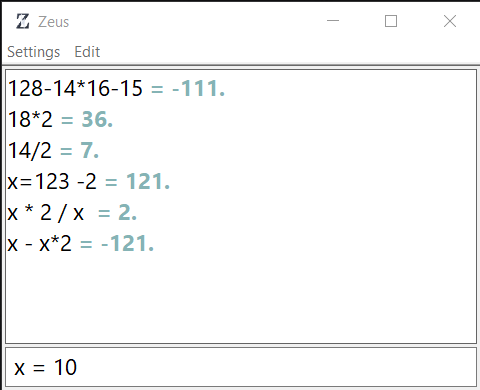

# Zeus



## about
is a Keyborad base calculator that allow the use of varables inside the input, currently only for windows  

## Uses
---
Input form : 
```
x = 1 * 4 // press enter 
```

output form : 
```
x = 1* 4 = 4
```

then you can just use the value of x in any other calcualtiton you enter ex: 

input form : 
~~~
2 * x + 1 
~~~

output form : 
```
x = 1* 4 = 4
2 * x  + 1 = 9 
```

the list of allowed opraters and how to use can be found in [[opraters]]


## know bugs 
- program crash with alot of varables to repalce 
- debug cmd when touch crash 
- input form overlaps last result if font size is big 


## Building the app 
you should have `gcc` and windows headers then only run `build.bat` for official release or `build(debug).bat` for debug version 

## credits 
The `.ini` library is from [rxi](https://github.com/rxi/ini) 